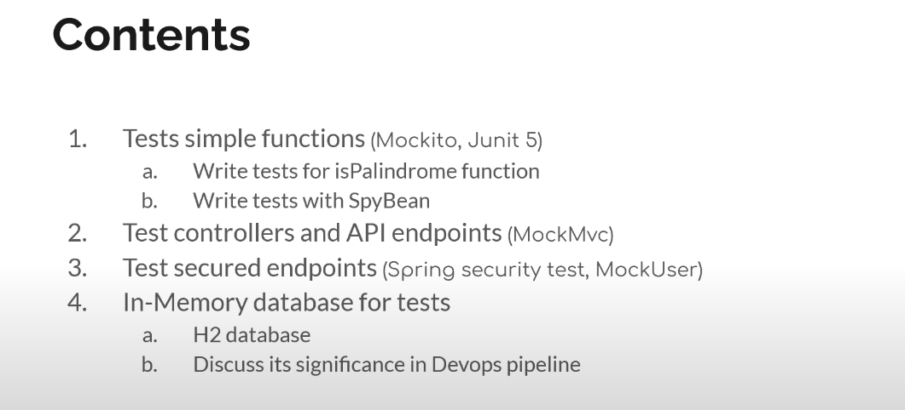
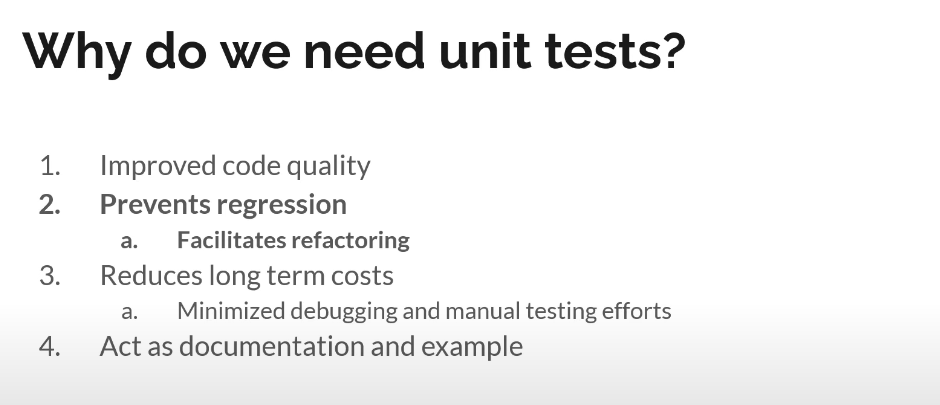
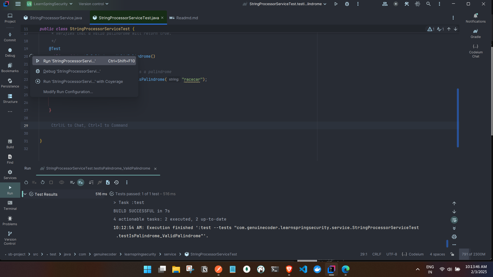
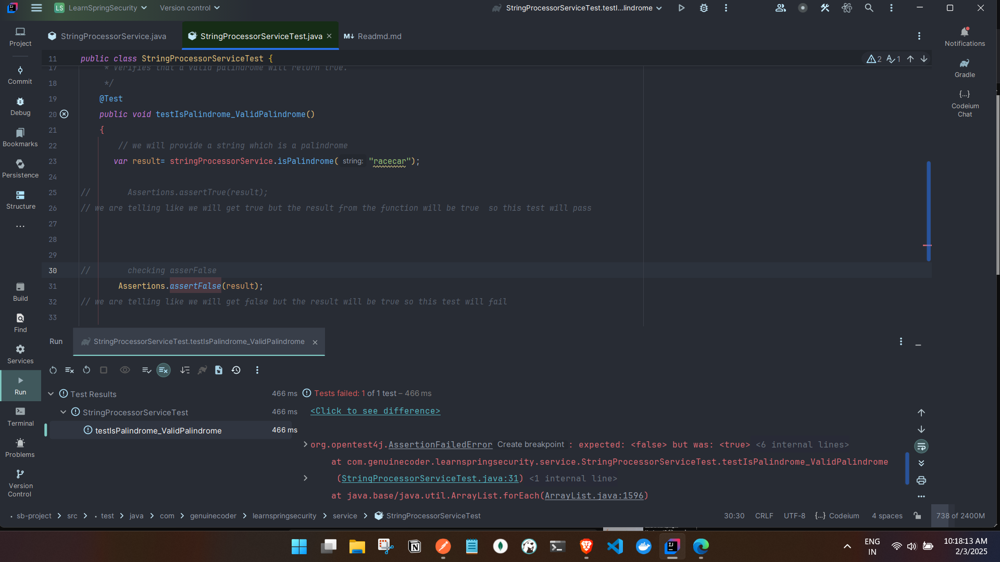
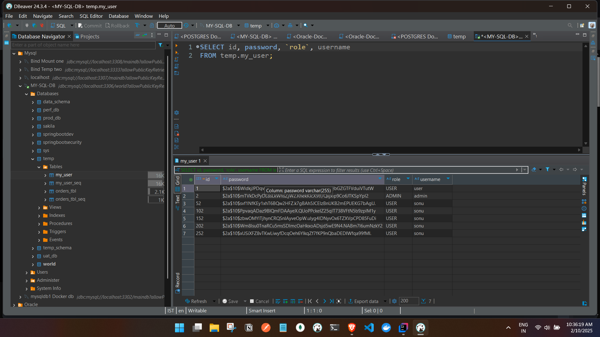

# Unit Testing in Spring Boot | JUnit, Mockito




## Why do we need unit tests?



- Add Dependency in project:
Note: Automatically added while creating project.
````
    testImplementation 'org.springframework.boot:spring-boot-starter-test'
    testRuntimeOnly 'org.junit.platform:junit-platform-launcher'
````

**IMP**


#### Creating a unit test for a service 
- function which checks palindrome:
````

@Service
public class StringProcessorService {

    public boolean isPalindrome(String string)
    {
        return  new StringBuilder(string).reverse().toString().equals(string);
    }
}

````

- Creating a test class:

**IMP**

- create the test class and follow the best practices like in test folder create a service package
and create the class name as the service name and suffix as Test.
- for example StringProcessorServiceTest for StringProcessorService.
- Annotate with @SpringBootTest and @Autowire the service.
- For Every unit test annotate with @Test


**IMP**

- For our palindrome function we will test for 
- valid String
- invalid String
- null data 

**IMP**

And the name of the unit test function should really convey the idea what we are going to do in the specific test.
eg. testIsPalindromeValidString, testIsPalindromeInvalidString, testIsPalindromeNullData.......
````

@SpringBootTest
// by adding this annotation this will enable the configuration for testing class in backend.
public class StringProcessorServiceTest {

    @Autowired
    private StringProcessorService stringProcessorService;

 /**
     * Verifies that a valid palindrome will return true.
     */
    @Test
    public void testIsPalindrome_ValidPalindrome()
    {
        // we will provide a string which is a palindrome
       var result= stringProcessorService.isPalindrome("racecar");

        Assertions.assertTrue(result);

    }
}
````

- Run the test class and check the result here we are running only specific test.

- asserting flase in true result:


- test failed as the result was true but we assertedFalse.

- Complete Unit Tests for StringProcessorService:
````
package com.ashfaq.unittesting.service;

import org.junit.jupiter.api.Assertions;
import org.junit.jupiter.api.Test;
import org.mockito.Mock;
import org.mockito.Mockito;
import org.springframework.beans.factory.annotation.Autowired;
import org.springframework.boot.test.context.SpringBootTest;
import org.springframework.boot.test.mock.mockito.SpyBean;

import java.time.Year;

@SpringBootTest
public class DiscountServiceTest {


//@Autowired with autowire we cannot use @SpyBean concept so  comment the @Autowired and use @SpyBean
@SpyBean
private DiscountService discountService;

@Test
    public void testCalculateDiscount_ValidInput() {
    var result= discountService.calculateDiscount(10,"THANKSGIVING");
    Assertions.assertEquals(1f, result);

    }


    @Test
    public void testCalculateDiscount_ValidInputNull() {
        var result= discountService.calculateDiscount(10,null);
        Assertions.assertEquals(0, result);

    }


    /*

    Introduction to Spybean and Mockito
      for the function calculateDiscount the promocode  XMAS and as the year is hardcoded i.e 2029 so when we provide the promo code as XMAS  and year is as 2029 then the logic will work.
 if we see the year is 2025(current year) someother year which is not 2029 will fail, so we have to mock the method to return the year 2029 all the time, even though current can be any year.
     if we dont mock the method  getCurrentYear() will give us the current year i.e 2025 which will fail
     so we have to mock the method to return the year 2029 so the test will pass
     */

    @Test
    public void testCalculateDiscount_ValidPromoCodeForYear2025() {
        Mockito.when(discountService.getCurrentYear()).thenReturn(Year.of(2029));
        var result= discountService.calculateDiscount(20,"XMAS");
        Assertions.assertEquals(5f, result);

    }

/*
Test case is passed even the year is not 2029, so we have to mock the method to return the year 2029 using the Mockito.when(discountService.getCurrentYear()).thenReturn(Year.of(2029)) and @SpyBean;
 */
/*
Testing for diff year and expecting 0 as result

for year 2024 the result will be 0 as there is no discount
 */


    @Test
    public void testCalculateDiscount_ValidPromoCodeForYear2024() {
        Mockito.when(discountService.getCurrentYear()).thenReturn(Year.of(2024));// here the yar will be 2024 and the logic is XMAS and 2029 so function will return 0
        var result= discountService.calculateDiscount(20,"XMAS");

        Assertions.assertEquals(0f, result);

    }

/*
Note we can access the getCurrentYear() function even thought its a package private function
i,e accessed only in the package, we are able to access in test is because we are following the same package structure

if we make the util function private then we cannot access it in test

so make the function in default access so that it can be accessed in test, so we can access the function in test if we follow the same package structure
or make the function accessible with getters.

 */


}


````


### Understanding Mockito And Spybean

- Create a new class DiscountService
````
package com.ashfaq.unittesting.service;

import org.springframework.stereotype.Component;

import java.time.Year;

@Component
public class DiscountService    {

public float calculateDiscount(float amount,String promoCode){
if(promoCode==null){
    return 0;
}
if(promoCode.equals("THANKSGIVING")) {
return  amount * 0.1f;
}

    if(promoCode.equals("XMAS") && getCurrentYear().getValue() == 2029){
return  amount * 0.25f;
    }

    return 0;
}

 Year getCurrentYear() {
    return Year.now();
}
/*
Here we have a function which checks discount for a user based on promocode
if the promocode is null then we return 0
if the promocode is THANKSGIVING then we return 10% discount
if the promocode is XMAS and year is 2029  CURRENT YEAR .then we return 25% discount


Now we need to test this function
and this function has a helper function which returns current year
so for the unit test we can use @spybean


 */


}

````

- Create a new class DiscountServiceTest
````

package com.ashfaq.unittesting.service;

import org.junit.jupiter.api.Assertions;
import org.junit.jupiter.api.Test;
import org.mockito.Mock;
import org.mockito.Mockito;
import org.springframework.beans.factory.annotation.Autowired;
import org.springframework.boot.test.context.SpringBootTest;
import org.springframework.boot.test.mock.mockito.SpyBean;

import java.time.Year;

@SpringBootTest
public class DiscountServiceTest {


//@Autowired with autowire we cannot use @SpyBean concept so  comment the @Autowired and use @SpyBean
@SpyBean
private DiscountService discountService;

@Test
    public void testCalculateDiscount_ValidInput() {
    var result= discountService.calculateDiscount(10,"THANKSGIVING");
    Assertions.assertEquals(1f, result);

    }


    @Test
    public void testCalculateDiscount_ValidInputNull() {
        var result= discountService.calculateDiscount(10,null);
        Assertions.assertEquals(0, result);

    }


    /*

    Introduction to Spybean and Mockito
      for the function calculateDiscount the promocode  XMAS and as the year is hardcoded i.e 2029 so when we provide the promo code as XMAS  and year is as 2029 then the logic will work.
 if we see the year is 2025(current year) someother year which is not 2029 will fail, so we have to mock the method to return the year 2029 all the time, even though current can be any year.
     if we dont mock the method  getCurrentYear() will give us the current year i.e 2025 which will fail
     so we have to mock the method to return the year 2029 so the test will pass
     */

    @Test
    public void testCalculateDiscount_ValidPromoCodeForYear2025() {
        Mockito.when(discountService.getCurrentYear()).thenReturn(Year.of(2029));
        var result= discountService.calculateDiscount(20,"XMAS");
        Assertions.assertEquals(5f, result);

    }

/*
Test case is passed even the year is not 2029, so we have to mock the method to return the year 2029 using the Mockito.when(discountService.getCurrentYear()).thenReturn(Year.of(2029)) and @SpyBean;
 */
/*
Testing for diff year and expecting 0 as result

for year 2024 the result will be 0 as there is no discount
 */


    @Test
    public void testCalculateDiscount_ValidPromoCodeForYear2024() {
        Mockito.when(discountService.getCurrentYear()).thenReturn(Year.of(2024));// here the yar will be 2024 and the logic is XMAS and 2029 so function will return 0
        var result= discountService.calculateDiscount(20,"XMAS");

        Assertions.assertEquals(0f, result);

    }

/*
Note we can access the getCurrentYear() function even thought its a package private function
i,e accessed only in the package, we are able to access in test is because we are following the same package structure

if we make the util function private then we cannot access it in test

so make the function in default access so that it can be accessed in test, so we can access the function in test if we follow the same package structure
or make the function accessible with getters.

 */


}


````

### Unit test for controllers and API endpoints
- We will create the unit test for RegistrationController

- RegistrationController
````
package com.ashfaq.unittesting.controller;

import model.com.ashfaq.unittesting.MyUser;
import model.com.ashfaq.unittesting.MyUserRepository;
import org.springframework.beans.factory.annotation.Autowired;
import org.springframework.http.HttpStatus;
import org.springframework.http.ResponseEntity;
import org.springframework.security.crypto.password.PasswordEncoder;
import org.springframework.web.ErrorResponse;
import org.springframework.web.bind.annotation.ExceptionHandler;
import org.springframework.web.bind.annotation.PostMapping;
import org.springframework.web.bind.annotation.RequestBody;
import org.springframework.web.bind.annotation.RestController;
import org.springframework.web.server.ServerErrorException;

@RestController
public class RegistrationController {

    @Autowired
    private MyUserRepository myUserRepository;
    @Autowired
    private PasswordEncoder passwordEncoder;

    @PostMapping("/register/user")
    public MyUser createUser(@RequestBody MyUser user) {
        user.setPassword(passwordEncoder.encode(user.getPassword()));
        return myUserRepository.save(user);
    }


    @ExceptionHandler
    public ResponseEntity<ErrorResponse> handleIllegalArgumentException(IllegalArgumentException e) {
        return ResponseEntity.status(HttpStatus.INTERNAL_SERVER_ERROR).body(new ServerErrorException("NPE " , e));
    }

}

````
- Unit test for RegistrationController
````
package com.ashfaq.unittesting.controller;


import com.fasterxml.jackson.databind.ObjectMapper;
import model.com.ashfaq.unittesting.MyUser;
import org.hamcrest.Matchers;
import org.junit.jupiter.api.Test;
import org.springframework.beans.factory.annotation.Autowired;
import org.springframework.boot.test.autoconfigure.web.servlet.AutoConfigureMockMvc;
import org.springframework.boot.test.context.SpringBootTest;
import org.springframework.http.MediaType;
import org.springframework.test.web.servlet.MockMvc;
import org.springframework.test.web.servlet.request.MockMvcRequestBuilders;
import org.springframework.test.web.servlet.result.MockMvcResultMatchers;

import java.util.regex.Matcher;

@SpringBootTest
@AutoConfigureMockMvc
 class RegistrationControllerTest {

    @Autowired
    private MockMvc mockMvc;
    /*
    MockMvc is a class that allows us to perform HTTP calls to our Spring Boot application.
     */

    @Autowired
    private ObjectMapper objectMapper;
    /*
    ObjectMapper is a class that allows us to serialize and deserialize JSON objects.
    Objects -> Byte array or String JSON

    ***Alternative we can use Gson***

     */
    @Test
    public void testCreateUser_ValidUser()
    {

        var user = new MyUser();
        user.setUsername("sonu");
        user.setPassword("1234");
        user.setRole("USER");

        /*
        we have to user now we have to pass the user just like how we pass in  postman when requesting.
and also need to define how the response look like
         */
        try {
            mockMvc.perform(
                    MockMvcRequestBuilders.post("/register/user")
                            .contentType(MediaType.APPLICATION_JSON)
                            .content(objectMapper.writeValueAsString(user))// we have to pass the object as a json string or byte array i.e we have to serialize the object, we can use objectMapper to serialize the object


            ).andExpect(MockMvcResultMatchers.status().is(200))// we can perform like expect a single response method -> andExpect() or multiple responses method -> andExpectAll , or perform another action method ->  andDo().
                    .andExpect(MockMvcResultMatchers.jsonPath("$.username").value("sonu"))//in response, we are checking if the name is same as what we had provided
                    .andExpect(MockMvcResultMatchers.jsonPath("$.role").value("USER"))
                    .andExpect(MockMvcResultMatchers.jsonPath("$.password").value(Matchers.not("1234")))// the password should not be 1234 as the password will be encrypted
                    .andExpect(MockMvcResultMatchers.jsonPath("$.id").exists());//the id should exist as its auto generated by JPA
            //we can test the function.
        } catch (Exception e) {
            throw new RuntimeException(e);
        }


    }

    @Test
    public void testCreateUser_InvalidUser()
    {

        var user = new MyUser();
        user.setUsername("sonu");
        /*
        we will not provide the password and role
         */
//        user.setPassword("1234");
//        user.setRole("USER");

        /*
        we have to user now we have to pass the user just like how we pass in  postman when requesting.
and also need to define how the response look like
         */
        try {
            mockMvc.perform(
                            MockMvcRequestBuilders.post("/register/user")
                                    .contentType(MediaType.APPLICATION_JSON)
                                    .content(objectMapper.writeValueAsString(user))// we have to pass the object as a json string or byte array i.e we have to serialize the object, we can use objectMapper to serialize the object


                    ).andExpect(MockMvcResultMatchers.status().isInternalServerError());// we can perform like expect a single response method -> andExpect() or multiple responses method -> andExpectAll , or perform another action method ->  andDo().
            //we can test the function.
        } catch (Exception e) {
            throw new RuntimeException(e);
        }


    }
    /*
    as we are not passing the role and password we are getting IllegalArgumentException: so we have created a exception handler to provide an internal server error response

    @ExceptionHandler
    public ResponseEntity<ErrorResponse> handleIllegalArgumentException(IllegalArgumentException e) {
        return ResponseEntity.status(HttpStatus.INTERNAL_SERVER_ERROR).body(new ServerErrorException("NPE " , e));
    }
    
    

     */


}


````

###  Unit test with Spring Security Test | WithMockUser

#### Note : when testing the spring security we need to make sure we have also added the lib spring-security-test which automatically comes along the spring security lib

- Testing endpoints which are protected using spring security.

- Endpoints:
````
package com.ashfaq.unittesting.controller;

import org.springframework.stereotype.Controller;
import org.springframework.web.bind.annotation.GetMapping;

@Controller
public class ContentController {

  @GetMapping("/home")
  public String handleWelcome()
  {
    return "home";
  }

  @GetMapping("/admin/home")
  public String handleAdminHome() {
    return "home_admin";
  }

  @GetMapping("/user/home")
  public String handleUserHome() {
    return "home_user";
  }

  @GetMapping("/login")
  public String handleLogin() {
    return "custom_login";
  }
}

````
- Unit test with Spring Security Test | WithMockUser
- Creating a unit test for a protected endpoint class ContentControllerTest

```
package com.ashfaq.unittesting.controller;

import org.junit.jupiter.api.Test;
import org.springframework.beans.factory.annotation.Autowired;
import org.springframework.boot.test.autoconfigure.web.servlet.AutoConfigureMockMvc;
import org.springframework.boot.test.context.SpringBootTest;
import org.springframework.security.test.context.support.WithMockUser;
import org.springframework.test.web.servlet.MockMvc;
import org.springframework.test.web.servlet.request.MockMvcRequestBuilders;
import org.springframework.test.web.servlet.result.MockMvcResultMatchers;

@SpringBootTest
@AutoConfigureMockMvc
class ContentControllerTest {

    /*
    Note : when testing the spring security we need to make sure we have also added the lib spring-security-test which automatically comes along the spring security lib
     */
    @Autowired
    private MockMvc mockMvc;


    @Test
    void testWelcome_withoutLogin() {
        try {
            mockMvc.perform(MockMvcRequestBuilders.get("/home")).andExpect(MockMvcResultMatchers.status().isOk());
        } catch (Exception e) {
            throw new RuntimeException(e);
        }
    }


    /*
    this will fail as we are accessing the api without providing the credentials.
     */
    @Test
    void testUserWelcome_withoutLogin() {
        try {
            mockMvc.perform(MockMvcRequestBuilders.get("/user/home")).andExpect(MockMvcResultMatchers.status().is(302));
            /*
            302 because we are redirecting to the login page

            flow when we have not authenticated and call the url /user/home spring security will redirect us to the login page
            so the redirect status will be 302
             */
        } catch (Exception e) {
            throw new RuntimeException(e);
        }


    }


    @Test
    @WithMockUser(username = "tester", roles = "USER")
//here we can define the username , role , password and authorities.
    void testUserWelcome_WithLogin() {
        try {

            /*
            in browser, we can provide creds and go to /user/home
            here we have to here we can stimulate the same flow using  @WithMockUser
            make sure we have added the lib spring-security-test


            eg     @WithMockUser(username = "tester", roles = "USER" )//here we can define the username , role , password and authorities.
              this will stimulate the logged-in user

            */
            mockMvc.perform(MockMvcRequestBuilders.get("/user/home")).andExpect(MockMvcResultMatchers.status().is(200));

        } catch (Exception e) {
            throw new RuntimeException(e);
        }
    }


    @Test
    void testAdminWelcome_withoutLogin() {
        try {
            mockMvc.perform(MockMvcRequestBuilders.get("/admin/home")).andExpect(MockMvcResultMatchers.status().is(302));
            /*
            302 because we are redirecting to the login page

            flow when we have not authenticated and call the url /user/home spring security will redirect us to the login page
            so the redirect status will be 302
             */
        } catch (Exception e) {
            throw new RuntimeException(e);
        }


    }


    @Test
    @WithMockUser(username = "tester", roles = "ADMIN")
//here we can define the username , role , password and authorities.
    void testAdminWelcome_WithLogin() {
        try {

            /*
            in browser, we can provide creds and go to /user/home
            here we have to here we can stimulate the same flow using  @WithMockUser
            make sure we have added the lib spring-security-test


            eg     @WithMockUser(username = "tester", roles = "USER" )//here we can define the username , role , password and authorities.
              this will stimulate the logged-in user

            */
            mockMvc.perform(MockMvcRequestBuilders.get("/admin/home")).andExpect(MockMvcResultMatchers.status().is(200));

        } catch (Exception e) {
            throw new RuntimeException(e);
        }
    }


/*
Normal user calling admin/home
 */


    @Test
    @WithMockUser(username = "tester", roles = "USER")
//here we can define the username , role , password and authorities.
    void testAdminWelcome_WithUserLogin() {
        try {

            /*
            in browser, we can provide creds and go to /user/home
            here we have to here we can stimulate the same flow using  @WithMockUser
            make sure we have added the lib spring-security-test


            eg     @WithMockUser(username = "tester", roles = "USER" )//here we can define the username , role , password and authorities.
              this will stimulate the logged-in user

            */
            mockMvc.perform(MockMvcRequestBuilders.get("/admin/home")).andExpect(MockMvcResultMatchers.status().is(403));

        } catch (Exception e) {
            throw new RuntimeException(e);
        }
    }


    /*
    Admin user calling user/home

     */
    @Test
    @WithMockUser(username = "tester", roles = "ADMIN")
//here we can define the username , role , password and authorities.
    void testUserWelcome_WithAdminLogin() {
        try {

            /*
            in browser, we can provide creds and go to /user/home
            here we have to here we can stimulate the same flow using  @WithMockUser
            make sure we have added the lib spring-security-test


            eg     @WithMockUser(username = "tester", roles = "USER" )//here we can define the username , role , password and authorities.
              this will stimulate the logged-in user

            */
            mockMvc.perform(MockMvcRequestBuilders.get("/user/home")).andExpect(MockMvcResultMatchers.status().is(403));

        } catch (Exception e) {
            throw new RuntimeException(e);
        }
    }

}


```

### Special in-memory database for unit tests
- When we ran the  [RegistrationControllerTest.java](src/test/java/com/genuinecoder/learnspringsecurity/controller/RegistrationControllerTest.java)
- the function added users but used real database as we can see below in picture.
- post testing we dont need this data in our DB. 
  a.To resolve this we can create a clean up function AfterEach test case has ran and clear data from DB but this will delete all the users in the actual application database.
  b. Use the in memory database specially for testing.
```commandline
 @Test
    public void testCreateUser_ValidUser()
    {

        var user = new MyUser();
        user.setUsername("sonu");
        user.setPassword("1234");
        user.setRole("USER");

        /*
        we have to user now we have to pass the user just like how we pass in  postman when requesting.
and also need to define how the response look like
         */
        try {
            mockMvc.perform(
                    MockMvcRequestBuilders.post("/register/user")
                            .contentType(MediaType.APPLICATION_JSON)
                            .content(objectMapper.writeValueAsString(user))// we have to pass the object as a json string or byte array i.e we have to serialize the object, we can use objectMapper to serialize the object


            ).andExpect(MockMvcResultMatchers.status().is(200))// we can perform like expect a single response method -> andExpect() or multiple responses method -> andExpectAll , or perform another action method ->  andDo().
                    .andExpect(MockMvcResultMatchers.jsonPath("$.username").value("sonu"))//in response, we are checking if the name is same as what we had provided
                    .andExpect(MockMvcResultMatchers.jsonPath("$.role").value("USER"))
                    .andExpect(MockMvcResultMatchers.jsonPath("$.password").value(Matchers.not("1234")))// the password should not be 1234 as the password will be encrypted
                    .andExpect(MockMvcResultMatchers.jsonPath("$.id").exists());//the id should exist as its auto generated by JPA
            //we can test the function.
        } catch (Exception e) {
            throw new RuntimeException(e);
        }


    }
```


- After each test case we will use deleteAllUsers() to delete all the users from DB.
````
 @Autowired
    private MyUserRepository myUserRepository;

    @AfterEach
    public void cleanUp()
    {

        log.info("AFTER EACH Clean up invoked");
        myUserRepository.deleteAll();//this will delete all the users
    }
    /*

    i.e we have two test cases here so 1st test case will run then cleanup function will run , then 2nd test case will run then cleanup function will run.
     eg
   testFunc1();
    ae();
   testFunc2();
    ae();

     */

-- Additional methods

    @BeforeEach
    public void setUp()
    {

        log.info("Before EACH set up invoked");
    }
 /*
    i.e this function will run before each test case
    eg
    be();
    testFunc1();
    be();
    testFunc2();
    .....
     */


    @BeforeAll
    public static void beforeAll()
    {
        log.info("BEFORE ALL invoked");
    }
    /*
    i.e this function will run before all the test cases

    eg
    beforeAll(); // only once executed
    testFunc1();
    testFunc2();
    testFunc2();

     */


    @AfterAll
    public static void afterAll(){
        log.info("AFTER ALL invoked");
    }
 /*
    i.e this function will run after all the test cases

    eg
    testFunc1();
    testFunc2();
    testFunc2();
    AfterAll(); // only once executed

     */

````
- Now we can use the in-memory database for testing.
- add the h2 db lib and configure it in application.properties Note we can add the lib for dev purpose and for test purpose 
- so we will add only for testing purpose same how we have for spring security on lib for development purpose spring-boot-starter-security and for testing purpose spring-boot-starter-test
- i.e 
```commandline
   implementation 'com.mysql:mysql-connector-j'
    testImplementation 'com.h2database:h2'
```
- we have h2 db for testing and mysql for development purpose defined in build.gradle
- Now create a resources folder > add application.properties file and configure the h2 DB for testing.
- Build the code and test it.